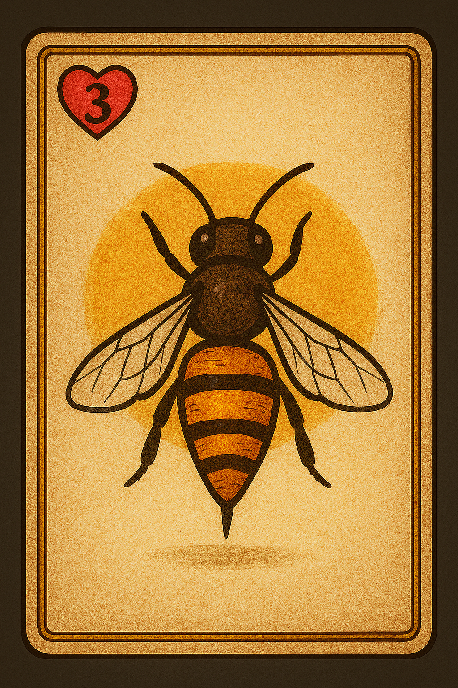
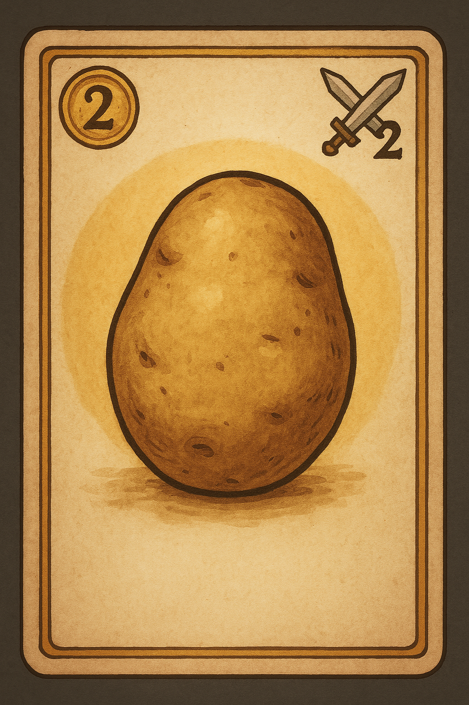
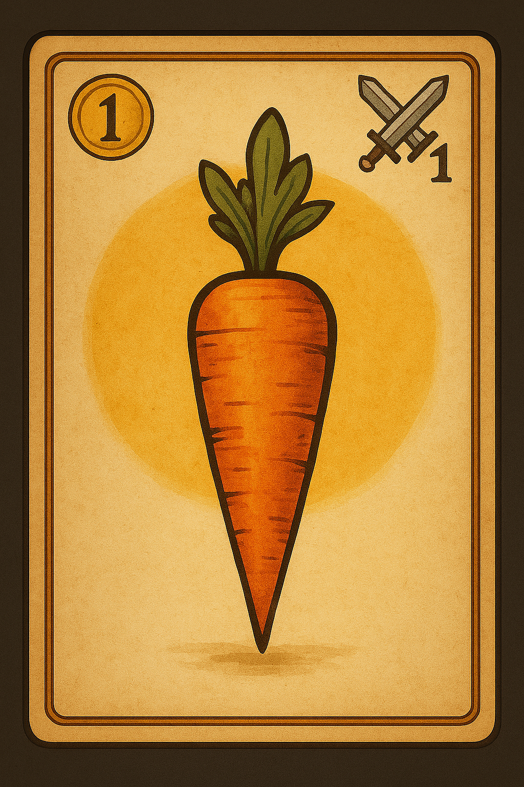

Paper Prototype: Fields of Survival
Overzicht

Dit prototype toont de core mechanic: gewassen opofferen voor combat of voor quota. We testen of spelers strategische keuzes maken met beperkte resources.

Kaarten

Wesp (3 HP)
	

Aardappel – 2 aanval, 2 munten
	

Wortel – 1 aanval, 1 munt
	

Per ronde gebruiken we:

	1 wesp

	3 aardappelen

	3 wortels

Speelverloop

	Speler krijgt 3 aardappelen + 3 wortels.

	Wesp (3 HP) wordt opengelegd.

	Speler kiest per gewas: gebruiken voor aanval of bij quota leggen.

Quota wordt berekend als:

	Quota = 3 + aantal aardappelen gebruikt voor combat

Speler wint als:

	Minstens 3 schade op de wesp ligt.

	De munten ≥ quota.

Wat testen we?

	Begrijpt de speler dat gewassen twee functies hebben?

	Maakt de speler interessante keuzes tussen combat en quota?

	Is de quota-formule eerlijk en spannend?

	Voelt het puzzelen met beperkte middelen leuk aan?
